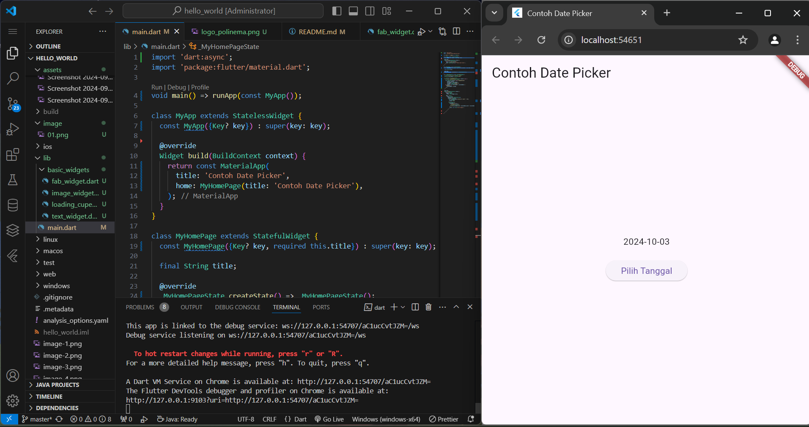

# **04. Brilliantna Salsabila (2241720041) / TI - 3B**

## **<b>PRAKTIKUM 1 </b>**
### **Langkah 1 :**
 Membuat application project dengan command flutter pada VSCode  
 - 
  
### **Langkah 2 :**
Memilih direktori yang akan digunakan untuk menyimpan project 
- 

### **Langkah 3 :**
Memberikan nama pada project yang akan dibuat  
- 

### **Langkah 4 :**
Tampilan awal project yang berhasil dibuat adalah sebagai berikut :  
- 

## **<b>PRAKTIKUM 2 </b>**
Menyambungkan perangkat Anda
- 
- 
- 
- 
- 

## **<b>PRAKTIKUM 3 </b>**
### **Langkah 1 :**
Login ke akun GitHub Anda, lalu buat repository baru dengan nama "flutter-fundamental-part1"
- 
### **Langkah 2 :**
Lalu klik tombol "Create repository" lalu akan tampil seperti gambar berikut.
- 
### **Langkah 3 :**
Kembali ke VS code, project flutter hello_world, buka terminal pada menu Terminal > New Terminal. Lalu ketik perintah berikut untuk inisialisasi git pada project Anda.
- 
### **Langkah 4 :**
Pilih menu Source Control di bagian kiri, lalu lakukan stages (+) pada file .gitignore untuk mengunggah file pertama ke repository GitHub.
- 
### **Langkah 8 :**
Salin tautan repository Anda dari browser ke bagian ini, lalu klik Add remote
- 
### **Langkah 9 :**
Lakukan hal yang sama pada file README.md mulai dari Langkah 4. Setelah berhasil melakukan push, masukkan username GitHub Anda dan password berupa token yang telah dibuat (pengganti password konvensional ketika Anda login di browser GitHub). Reload halaman repository GitHub Anda, maka akan tampil hasil push kedua file tersebut seperti gambar berikut.
- 
### **Langkah 10 :**
Lakukan push juga untuk semua file lainnya dengan pilih Stage All Changes. Beri pesan commit "project hello_world". Maka akan tampil di repository GitHub Anda seperti berikut.
- 
### **Langkah 11 :**
Kembali ke VS Code, ubah platform di pojok kanan bawah ke emulator atau device atau bisa juga menggunakan browser Chrome. Lalu coba running project hello_world dengan tekan F5 atau Run > Start Debugging. Tunggu proses kompilasi hingga selesai, maka aplikasi flutter pertama Anda akan tampil seperti berikut.
- 
### **Langkah 12 :**
Silakan screenshot seperti pada Langkah 11, namun teks yang ditampilkan dalam aplikasi berupa nama lengkap Anda. Simpan file screenshot dengan nama 01.png pada folder images (buat folder baru jika belum ada) di project hello_world Anda. Lalu ubah isi README.md seperti berikut, sehingga tampil hasil screenshot pada file README.md. Kemudian push ke repository Anda.

## **<b>PRAKTIKUM 4 </b>**
### **Langkah 1 :**
Buat folder baru basic_widgets di dalam folder lib. Kemudian buat file baru di dalam basic_widgets dengan nama text_widget.dart. Ketik atau salin kode program berikut ke project hello_world Anda pada file text_widget.dart.
- 
- 
### **Langkah 2 :**
Buat sebuah file image_widget.dart di dalam folder basic_widgets dengan isi kode berikut.
- 
- 
-
## **<b>PRAKTIKUM 5 </b>**
### **Langkah 1 :**
Buat file di basic_widgets > loading_cupertino.dart. Import stateless widget dari material dan cupertino. Lalu isi kode di dalam method Widget build adalah sebagai berikut.

### **Langkah 2 :**
Button widget terdapat beberapa macam pada flutter yaitu ButtonBar, DropdownButton, TextButton, FloatingActionButton, IconButton, OutlineButton, PopupMenuButton, dan ElevatedButton.
Buat file di basic_widgets > fab_widget.dart. Import stateless widget dari material. Lalu isi kode di dalam method Widget build adalah sebagai berikut.

### **Langkah 3 :**
Scaffold widget digunakan untuk mengatur tata letak sesuai dengan material design.
Ubah isi kode main.dart seperti berikut.

### **Langkah 4 :**
Dialog widget pada flutter memiliki dua jenis dialog yaitu AlertDialog dan SimpleDialog.
Ubah isi kode main.dart seperti berikut.

### **Langkah 5 :**
Flutter menyediakan widget yang dapat menerima input dari pengguna aplikasi yaitu antara lain Checkbox, Date and Time Pickers, Radio Button, Slider, Switch, TextField.
Contoh penggunaan TextField widget adalah sebagai berikut:

### **Langkah 6 :**
Date and Time Pickers termasuk pada kategori input dan selection widget, berikut adalah contoh penggunaan Date and Time Pickers.

## **<b> Tugas Praktikum </b>**

- First Hot Reload 

- Add Tools

- A Flutter crash course in 5 minutes

- Your first behavior

- Make the app prettier

- Extract a widget

- Add functionality
<video controls src="Namer App - Google Chrome 2024-10-03 20-56-23.mp4" title="Title"></video>
- Add the button 
<video controls src="Namer App - Google Chrome 2024-10-03 21-13-34.mp4" title="Title"></video>
-  Add navigation rail

- setState
<video controls src="Namer App - Google Chrome 2024-10-03 21-26-26.mp4" title="Title"></video>
- Use selectedIndex
<video controls src="Namer App - Google Chrome 2024-10-03 21-41-44.mp4" title="Title"></video>
- Responsiveness

- Add a new page
<video controls src="Namer App - Google Chrome 2024-10-03 22-02-45.mp4" title="Title"></video>
- 